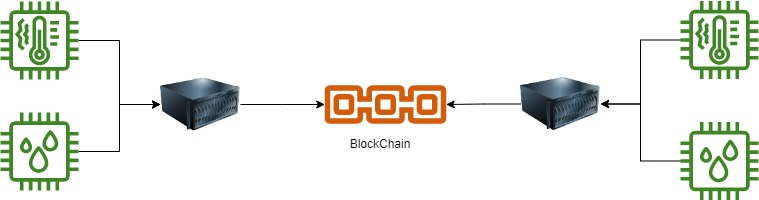
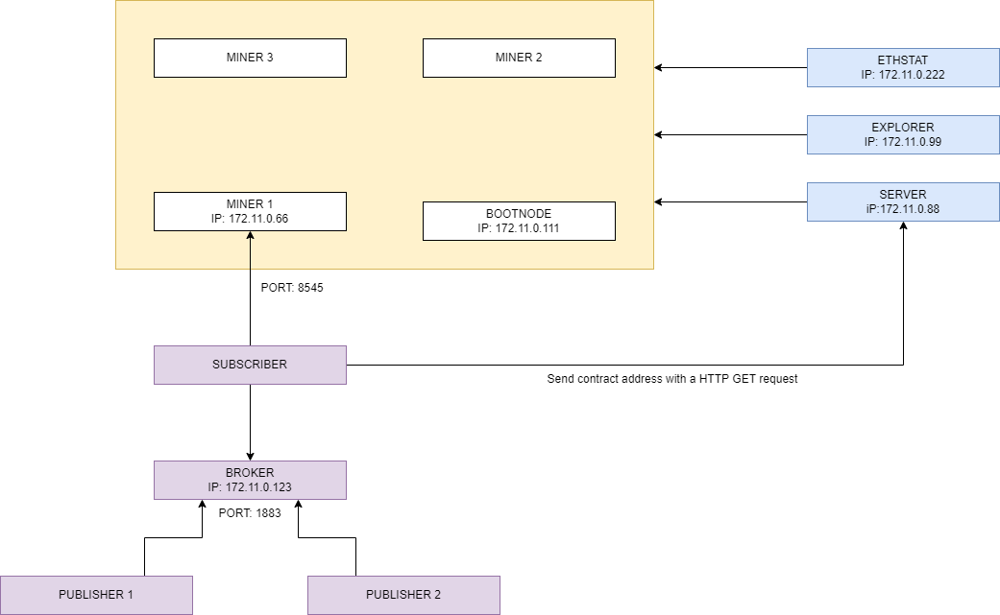
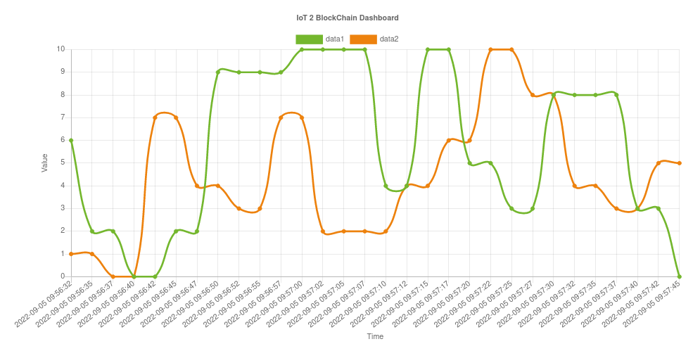
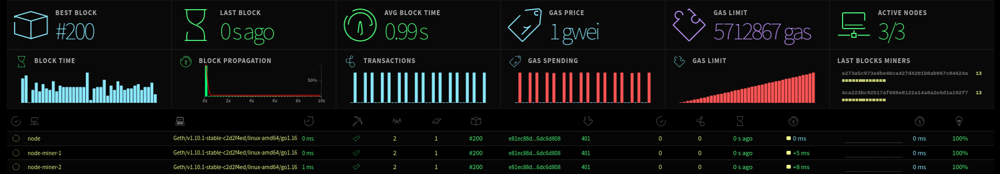
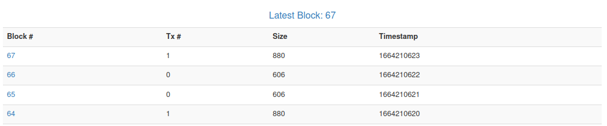

# IoT 2 BlockChain 

Il seguente progetto ha lo scopo di mostrate tutti i vantaggi che può portare l'implementazione del paradigma Web3 nel constesto dell'Internet of Thighs (IoT). Con questa soluzione si vuole mostare come una BlockChain privata può essere utilizzata per la validazione dei dati prodotti da un numero massivo di dispositivi smart. Tale aspetto è un importante requisito funzionale richiesto dalle architetture *Zero-Trust*. Le suddette architetture sono progettate secondo il principio *“verify and never trust"* e pertanto qualsiasi sistema all'interno dell'infrastruttura informatica deve essere considerato "non fidato" e le sue azioni devono essere monitorate e verificate al fine di indentificare eventuali compromissioni. 

**Questo progetto risulta essere una Proof of Concept. La sua realizzazione ha il solo scopo di mostrare la fattibilità di implementazione dei requisiti precedentemente descritti.**

## Architettura
L'architettura proposta ha lo scopo di mostrare come Ethereum e gli Smart Contract possano essere utilizzati per garantire l’integrità, la tracciabilità e la consistenza del dato raccolto da un generico sensore IoT. Il raggiungimento di tale obiettivo è reso possibile integrando le tecnologie appena citate con i principi architetturali dell’edge computing.

<p align="center">
   
</p>

Tale paradigma prevede che venga creata un’infrastruttura IT decentralizzata e distribuita che abbia il compito di elaborare i dati raccolti dagli smart device e successivamente registrarli su una blockchain privata. Tale approccio, oltre a ridurre notevolmente il traffico di rete, permette di offrire una soluzione maggiormente resiliente e scalabile. Infine, per verificare il corretto funzionamento dell’architettura è stata sviluppata una web application che permette di visualizzare tutti i dati memorizzati all’interno della blockchain.

Di seguito si fornisce uno schema dell'infrastruttura creata e una breve descrizione di ogni componente ivi presente.

- il nodo **subscriber** analizza e processa tutti i dati raccolti dai sensori e resi disponibili dai nodi publisher. Esso assume anche il compito di fare da **Proxy** verso la blockchain, effettuando tutte le operazioni necessarie per la memorizzazione dei dati all'interno della stessa;
- il **broker** è un software che consente la comunicazione asincrona e lo scambio di messaggi tra il publisher e i subscriber;
- il **miner** è un particolare nodo della blockchian che risulta essere autorizzato ad inserire nuovi blocchi all'interno della struttura dati;
- il servizio **bootnode** fornisce a tutti i miner node le informazioni necessarie per individuarsi vicendevolmente;
- il servizio **Ethstat** fornisce un'interfaccia visiva per monitorare lo stato della rete ethereum;
- il servizio **Explorer** permette di visualizzare il contenuto di ogni blocco presente all'interno della blockchain;
- il **server** espone un servizio HTTP che permette di visualizzare in tempo reale la telemetria dei dati raccolti dai nodi publisher e pubblicati all'interno della blockchain. 

<p align="center">
   
</p>

**Per una descrizione accurata dell'intero progetto si consiglia di leggere la documentazione associata.**

## Deploy 

### Prerequisiti 

Al fine di poter avviare l’architettura nella maniera corretta risulta necessario aver installato i seguenti applicativi sul proprio sistema:

- git ([https://git-scm.com/book/en/v2/Getting-Started-Installing-Git](https://git-scm.com/book/en/v2/Getting-Started-Installing-Git))
- docker ([https://docs.docker.com/engine/install/](https://docs.docker.com/engine/install/))
- docker-compose ([https://docs.docker.com/compose/](https://docs.docker.com/compose/))

Inoltre, per effettuare l’installazione del software mancante si consiglia di seguire le istruzioni presenti all’interno dei link indicati nella lista

### Avvio del progetto

Per avviare il progetto eseguire la seguente lista di comandi:
```bash
git clone https://github.com/NS-unina/IoT-2-BlockChain.git
cd IoT-2-BlockChain
docker-compose up 
```

[](https://asciinema.org/a/4V3ZJUayAs10ae3LnpQu41dx1)

### Proof of Concept 

### Publisher e subscriber
Il comportamento dei nodi publisher e subscriber è stato implementato attraverso l'utilizzo di due script *python*. Per verificare il corretto funzionamento dei programmi menzionati si consiglia di analizzare l'output dei suddeti script utilizzando i comandi qui riportati:

```bash
#output script nodo subscriber
docker log subscriber

#output scipt nodi publisher
docker log publisher
docker log publisher-2
```

[](https://asciinema.org/a/FRKzICdA1rIMrkOZpuB7dUBtv)

#### WebServer
Per visualizzare i *"dummy-data"* memorizzati all'interno della blockchain e generati dai due nodi publisher è stata implementata una realtime dashboard. Tale servizio è raggingibile all'indirizzo [http://localhost:5000](http://localhost:5000).

<p align="center">
   
</p>

## Altri servizi

**EthStat**

Per monitorare lo stato della blockchain privata è stato implementato un Ethereum Network Monitor. Tale servizio è accessibile all'indirizzo [http://localhost:3000](http://localhost:3000) e permette di visualizzare attraverso una dashboard le statistiche e i grafici inerenti alle prestazioni della blockchain. Di seguito è riportata una immagine esemplificativa di tale interfaccia.

<p align="center">
   
</p>

**Blockchain Explorer**

Il servizio blockchain explorer permette all'utente di visualizzare i dati contenuti all'interno di una transazione sulla catena. Tale funzionalità può essere utilizzata per comprendere come avviene l'istanziazione dello smart contract ed il salvataggio dei *"dummy-data"*. Tali funzionalità sono accessibili attraverso l'utilizzo di una web application raggiungibile all'indirizzo [http://localhost:8000](http://localhost:8000).

<p align="center">
   
</p>
